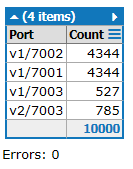

just an experiment
==================

dependencies
------------

```
npm install loadfire
pip install locustio
npm install nodemon -g
```

start
-----

windows:

```
start nodemon proxy.js
start node server.js 7001
start node server.js 7002
start node server.js 7003
start locust --host=http://localhost:8000
```

updating a server dynamically
-----------------------------

- remove port `7003` in `server.js`
- restart the `7003` instance
- add port `7003` back again

screenshot via in LINQPad:


